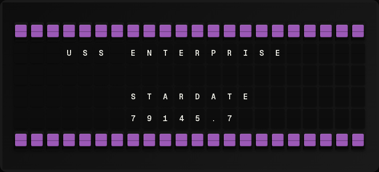

# Stardate Plugin

Display the current date as a Star Trek: The Next Generation (TNG) era stardate.



## Overview

The Stardate plugin calculates and displays the current date in the canonical TNG stardate format. Since we're living in the early 21st century (approximately 297 years before the TNG era begins), stardates are displayed as negative values.

## How Stardates Work

### The Canonical TNG Formula

Based on Star Trek: The Next Generation canon:

```
Stardate = (Year - 2323) × 1000 + (day_of_year / days_in_year × 1000)
```

### Key Facts

- **Stardate 0** = January 1, 2323
- **TNG Season 1** (2364) = Stardate 41xxx
- **Each year** = 1000 stardate units
- **Present day** (2020s) = Negative stardates (around -297xxx)

### Example Calculations

- **January 1, 2026**: (2026 - 2323) × 1000 + (1/365 × 1000) = **-296997.3**
- **February 22, 2026** (day 53): (2026 - 2323) × 1000 + (53/365 × 1000) = **-296854.8**
- **December 31, 2026**: (2026 - 2323) × 1000 + (365/365 × 1000) = **-296000.0**

### Leap Years

The calculation accounts for leap years automatically, using 366 days instead of 365 when appropriate.

## Usage

### Template Variable

The plugin exposes a single variable:

- `stardate` - Current TNG-era stardate (e.g., `-296854.8`)

### Example Template

```
Stardate: {{stardate}}
```

Output:
```
Stardate: -296854.8
```

## Configuration

### Settings

- **timezone** (optional): IANA timezone name for calculating the current date
  - Default: `America/Los_Angeles`
  - Example: `America/New_York`, `Europe/London`, `Asia/Tokyo`

### Configuration Example

```json
{
  "stardate": {
    "enabled": true,
    "timezone": "America/Los_Angeles"
  }
}
```

## Historical Context

### Star Trek Timeline

In Star Trek: The Next Generation, the crew of the USS Enterprise-D operates in the 24th century:

- **2364** - TNG Season 1 begins (Stardate 41xxx)
- **2370** - TNG final season (Stardate 47xxx)
- **Present day** - We're approximately 297-338 years in TNG's past

### Why Negative Stardates?

The TNG stardate system uses 2323 as its zero point. Since we're living before that reference date, our stardates are negative - similar to how years BCE are counted backwards from year 0 in the Gregorian calendar.

## Technical Details

- **Format**: Floating point with 1 decimal place (e.g., `-296854.8`)
- **Max Length**: 9 characters (includes minus sign, digits, and decimal)
- **Precision**: Calculated to the current day of the year
- **Accuracy**: Accounts for leap years (366 vs 365 days)

## References

- [Memory Alpha: Stardate](https://memory-alpha.fandom.com/wiki/Stardate)
- [Star Trek: The Next Generation Timeline](https://memory-alpha.fandom.com/wiki/Star_Trek%3A_The_Next_Generation)
